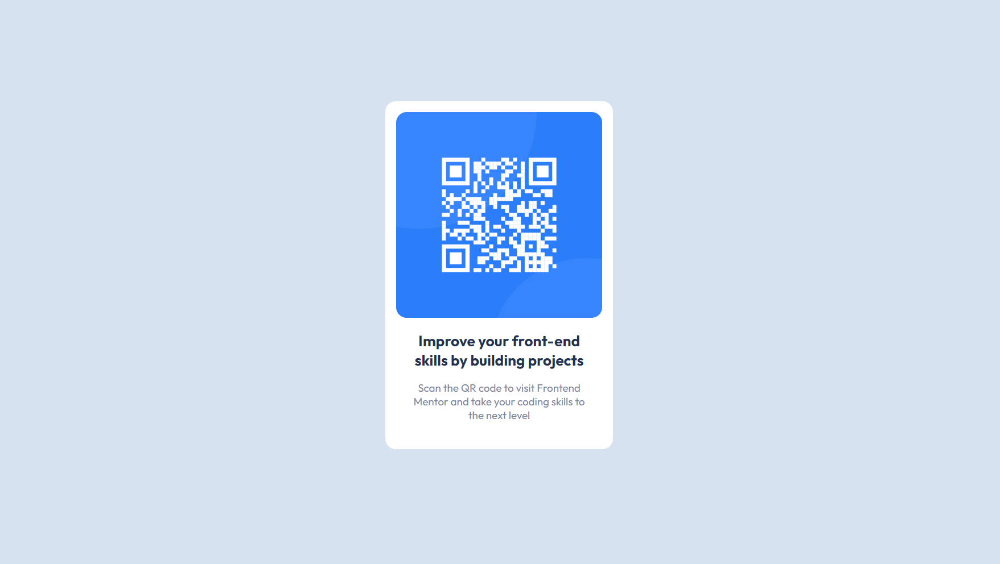

# Solução do desafio 'QR code component'
### Screenshot 

### Links

- Live Site URL: [Qr code component](https://github.com/jpaimwyz/qr-code-component)

## Autor

- Frontend Mentor - [@jpaimwyz](https://www.frontendmentor.io/profile/jpaimwyz)

Esta é a minha solução para o desafio titulado ['QR code component' do Frontend Mentor](https://www.frontendmentor.io/challenges/qr-code-component-iux_sIO_H). Os desafios do Frontend Mentor challenges ajudam a melhoras as habilidades de programação atráves da construção de desafios reais.

## Tabela de conteúdos
- [Meu processo](#meu-processo)
  - [Construído com](#construído-com)
  - [Melhorias](#melhorias)

## Meu processo
### Construído com:
  - HTML5 Semântico
  - CSS

### Melhorias

Não aprendi nada novo, mas com certeza me ajudou a praticar algumas skills antigas. Eu estimei um tempo de 50 minutos para terminar, e eu de fato terminei nesse tempo. Nos prõximos projetos eu gostaria de ver mais sobre layouts responsivos e acessibilidade em general. Apesar disso, foi um bom começo e eu estou feliz com os resultados que eu cheguei.