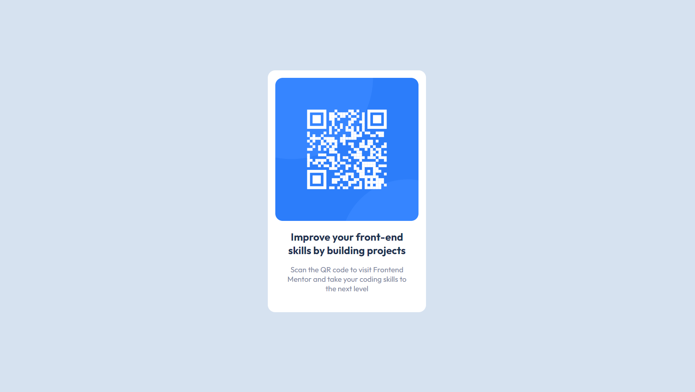

[English](#English) | [Portuguese](#Portuguese)

# Frontend Mentor - QR code component solution
### Screenshot 

### Links

- Solution URL: [Solution](https://your-solution-url.com)
- Live Site URL: [Site](https://your-live-site-url.com)

## Author

- Frontend Mentor - [@jpaimwyz](https://www.frontendmentor.io/profile/jpaimwyz)

## English
This is a solution to the [QR code component challenge on Frontend Mentor](https://www.frontendmentor.io/challenges/qr-code-component-iux_sIO_H). Frontend Mentor challenges help you improve your coding skills by building realistic projects. 

## Table of contents
- [My process](#my-process)
  - [Built with](#built-with)
  - [Continued development](#continued-development)

## My process
### Built with
  - Semantic HTML5
  - CSS

### Continued development

Didn't learn somenthing new but it sure helped me practice some old skills. I estimated a time to finish in 50 minutes, and i did finish it in 50 minutes. Next projects i would like to see more of responsive layouts and acessibility in general, despite that, it was a great start and i am happy with the results i achieved.

# Solução do desafio 'QR code component'
## Portuguese

Esta é a minha solução para o desafio titulado ['QR code component' do Frontend Mentor](https://www.frontendmentor.io/challenges/qr-code-component-iux_sIO_H). Os desafios do Frontend Mentor challenges ajudam a melhoras as habilidades de programação atráves da construção de desafios reais.

## Tabela de conteúdos
- [Meu processo](#meu-processo)
  - [Construído com](#construído-com)
  - [Melhorias](#melhorias)

## Meu processo
### Construído com:
  - HTML5 Semântico
  - CSS

### Melhorias

Não aprendi nada novo, mas com certeza me ajudou a praticar algumas skills antigas. Eu estimei um tempo de 50 minutos para terminar, e eu de fato terminei nesse tempo. Nos prõximos projetos eu gostaria de ver mais sobre layouts responsivos e acessibilidade em general. Apesar disso, foi um bom começo e eu estou feliz com os resultados que eu cheguei.
